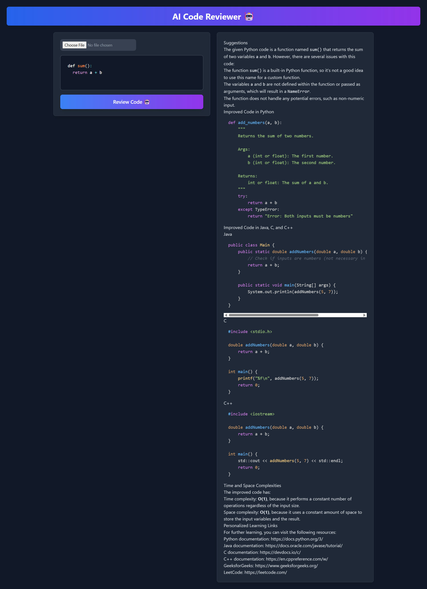

# AI Code Reviewer


*Screenshot: Example of the AI Code Reviewer web interface and output.*


*Screenshot: Additional view of the application (snap.png).*

# MERN Stack AI-Powered Web Application

This project demonstrates how to build a powerful AI-powered web application using the **MERN Stack** and the **Deepseek R1** model, running inference on the **Groq API** for ultra-fast AI responses. It integrates **React**, **Node.js**, **Express**, and **MongoDB** to create an AI chatbot or content generation tool.

## What You'll Learn:
- Setting up a MERN stack project
- Integrating the Deepseek R1 model with the Groq API for fast AI inference
- Building a responsive React frontend with **Tailwind CSS**
- Creating a **Node.js** & **Express** backend to handle AI requests

## Tech Stack:
- **MongoDB** – NoSQL database for storing AI interactions
- **Express.js** – Backend framework for handling requests
- **React.js** – Frontend library for building dynamic user interfaces
- **Tailwind CSS** – Utility-first CSS framework for responsive design
- **Node.js** – JavaScript runtime for server-side development
- **Deepseek R1** – Open-weight AI model for content generation and chatbot capabilities
- **Groq API** – Fast and efficient AI inference engine

## Project Setup

### Prerequisites:
- [Node.js](https://nodejs.org/en) (v16 or higher)
- [MongoDB](https://www.mongodb.com/) (Local or Cloud instance)
- [Groq API Key](https://groq.com/docs)
- [Tailwind CSS](https://v3.tailwindcss.com/docs/guides/vite)

### Installation:

1. Clone this repository
    

2. Install dependencies:
    - Backend (Node.js, Express):
        ```bash
        cd backend
        npm install
        ```
    - Frontend (React, Tailwind CSS):
        ```bash
        cd frontend
        npm install
        ```

3. Set up your **Groq API key** in the `.env` file in the backend directory:
    ```env
    GROQ_API_KEY=your-groq-api-key
    ```

4. Run the backend server:
    ```bash
    cd backend
    npx nodemon
    ```

5. Run the frontend development server:
    ```bash
    cd frontend
    npm run dev
    ```

6. Open the app in your browser:
    - Frontend: `http://localhost:5173`
    - Backend: `http://localhost:3000/

    